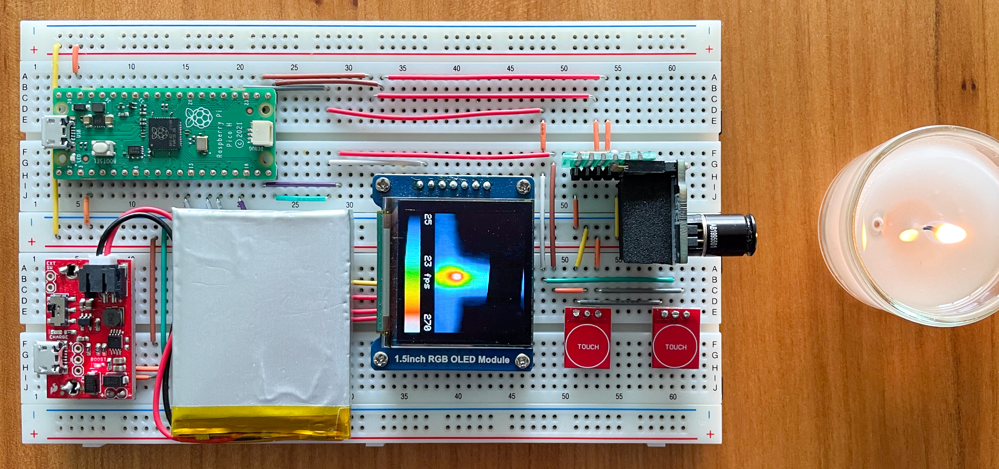
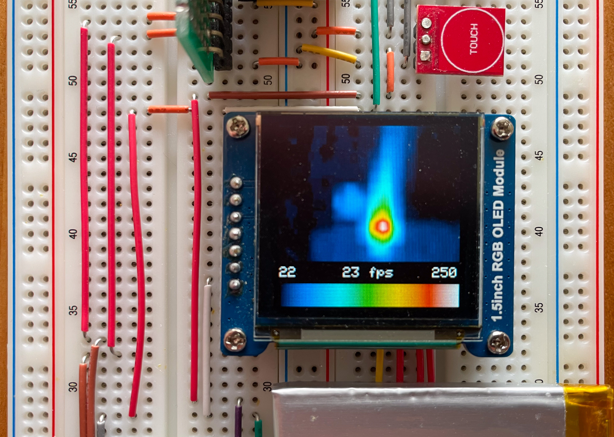

# Fast (23 fps) MLX90640 based Thermal Camera for Raspberry Pi Pico (RP2040)

A simple but fast Thermal Imaging Camera using the MLX90640 sensor, a 1.5 inch RGB OLED Display Module, and two optional touch sensor modules.

## Features
- fast: 23 frames per second by employing both cores of the 2040 (whereas a single core would only result in 11 fps):
  - core0 fetches the pages from the MLX90640 and scales the data down to 8-bit integers
  - core1 renders the data on the OLED after optionally smoothing the data by bilinear interpolation
- configurable heat-map (predefined 7-colors, 5-colors, 2-colors, and grey map)
- touch button for disabling interpolation
- touch button for freezing the displayed image

## Code Based on
- unmodified Melexis Driver: https://github.com/melexis/mlx90640-library/
- heat map code inspired by: http://www.andrewnoske.com/wiki/Code_-_heatmaps_and_color_gradients
- the [Pico SDK](https://www.raspberrypi.com/documentation/microcontrollers/c_sdk.html)

## Hardware
- Raspberry Pi Pico (RP2040)
- MLX90640 Thermal Camera Breakout (55º or 110º), e.g. [Pimoroni](https://shop.pimoroni.com/products/mlx90640-thermal-camera-breakout)
- 1.5inch RGB OLED Display Module, 65K RGB Colors, 128×128, SPI, e.g. [Waveshare](https://www.waveshare.com/1.5inch-rgb-oled-module.htm)
- Optional: 2 buttons, e.g. [TTP223 Touch Sensor Modules](https://hobbycomponents.com/sensors/901-ttp223-capacitive-touch-sensor)
- Optional: battery module, e.g. [LiPo Charger/Booster module](https://www.sparkfun.com/products/14411)

### Wiring

| MLX90640  | GPIO | Pin |
| --------- | ---- | --- |
| I2C0 SDA  | 16   | 21  |
| I2C0 SDC  | 17   | 22  |

| OLED     | GPIO | Pin |
| -------- | ---- | --- |
| SPI1 DC  | 9    | 12  |
| SPI1 SCK | 10   | 14  |
| SPI1 TX  | 11   | 15  |
| SPI1 CSn | 13   | 17  |
| SPI1 RST | 15   | 20  |

| Touch Buttons         | GPIO | Pin |
| --------------------- | ---- | --- |
| Disable Interpolation | 14   | 19  |
| Freeze Image          | 18   | 24  |

## Building
- make sure the "[Pico SDK](https://www.raspberrypi.com/documentation/microcontrollers/c_sdk.html)" is installed and the environment variable "PICO_SDK_PATH" refers to it.
- `git clone https://github.com/weinand/thermal-imaging-camera`
- `cd thermal-imaging-camera`
- `git submodule init`
- `git submodule update`
- `mkdir build`
- `cd build`
- `cmake ..`
- `make`

## More Images

